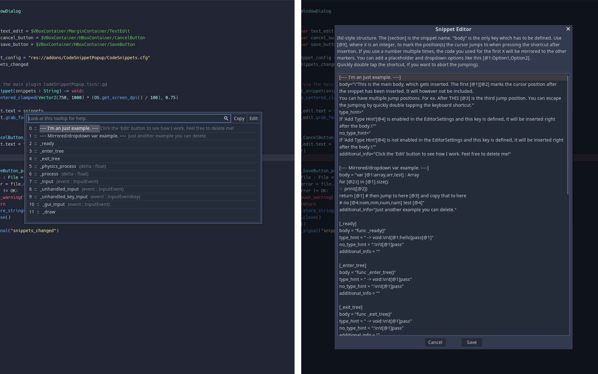

# A Godot Code Snippet Plugin

This plugin for Godot 3.2.X adds a popup which lists all available code snippets. The popup is shown with Control+Tab. 

The snippets can be filtered by a search_string. Ending the seach_string with " X" will jump to the X-th item in the snippet list. Activating a snippet will insert it at the cursor position. The snippets can be edited within Godot itself using the "Edit" button. You can define multiple positions the cursor will jump to in the snippet after insertion with an "[@X]" (and pressing the keyboard shortcut again). X needs to be an integer. Using the same number multiple times will "mirror"  variables to the same markers (see the example in the plugin).

Starting the search_string with "sig " will list all available signals of the current scene root. Activating a signal will insert the connection code at the cursor position and copy the signal method to the clipboard.

**Installation**:

Either download it from the official Godot AssetLib (within Godot itself) or download the addons folder from GitHub (https://github.com/Leleat/AGodotCodeSnippetPlugin) and move it to the root (res://) of your project. Enable the plugin in the project settings.

