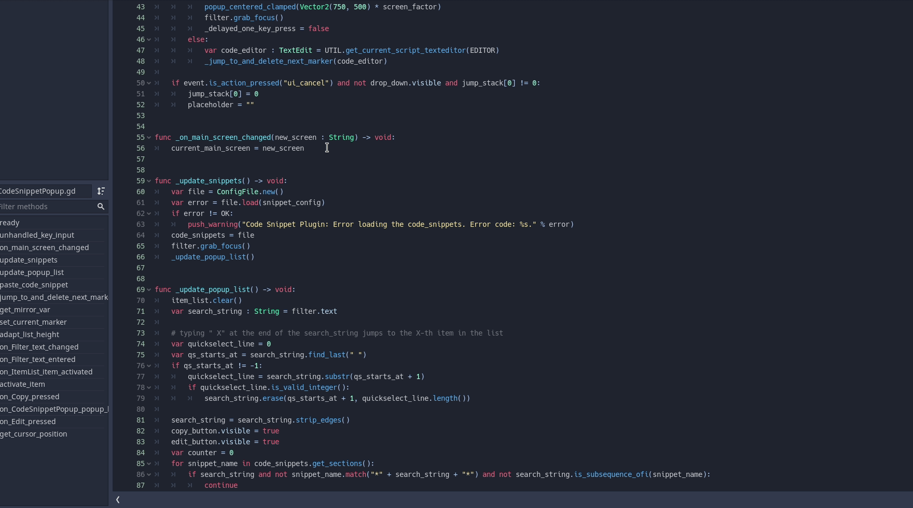

# A Godot Code Snippet Plugin

This plugin for Godot 3.2.X adds a popup which lists predefined code snippets. You can add your own snippets using a built-in editor. The popup is shown with **Control+Tab**. Read the built-in help page to see how to use this plugin.

**Features**:

- tabstops (the order of the jumping is defined by the user)
- mirrorable variables
- placeholders/dropdown choice (see gif)
- The snippets can be filtered by a search_string. Ending the seach_string with " X" will jump to the X-th item in the snippet list. 

*As far as I know Godot doesn't provide a way to get the position of the text cursor (neither global nor local). So I had to calculate (approximate) it manually by using the font size and the number of visible lines; see func _get_cursor_position() in CodeSnippetPopup.gd. That means the position of the placeholder/choice popup can be pretty wonky. Will need to come up with a more robust way.*

**Installation**:

Either download it from the official Godot AssetLib (within Godot itself) or download the addons folder from GitHub (https://github.com/Leleat/AGodotCodeSnippetPlugin) and move it to the root (res://) of your project. Enable the plugin in the project settings.

**Preview**

