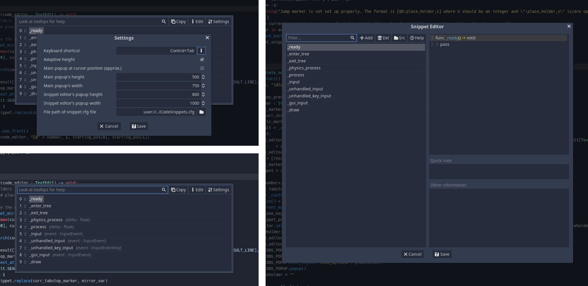

# A Godot Code Snippet Plugin

This plugin adds code snipptes to Godot 3.2.X. The popup is default shown with **Control+T**. Read the built-in help page and the tooltips to see how to use this plugin.

**Features**:

- tabstops (the order of the jumping is defined by the user)
- mirrorable variables
- placeholders/dropdown choice (see gif)
- The snippets can be filtered by a search_string. Ending the seach_string with " X" will jump to the X-th item in the snippet list. 

*See the issues for known bugs/limitations.*

**Installation**:

Either download it from the official Godot AssetLib (within Godot itself) or download the addons folder from GitHub (https://github.com/Leleat/AGodotCodeSnippetPlugin) and move it to the root (res://) of your project. Enable the plugin in the project settings.

**Preview**

**Changelog**

[1.2.1]
- SnippetEditor: added shortcut keys for help button, main TextEditor and other TextEditor (#5)
- SnippetEditor: added rename, move up and down buttons. increased the default width of the editor to compensate for added buttons. (#5)
- SnippetEditor: added a (sorta) detection for wrong formatting when saving the snippet file (#5)

[1.2.0]
- enabled key navigation for the options popup. For example if the OptionsPopup has the options Alpha,Beta and Gamma, pressing "G" will jump to the Gamma option.
- changed default keyboard shortcut to Ctrl+T as Ctrl+Tab caused conflicts if you had code selected.
- added StatusPopup when aborting or finishing snippet insertion

- BUGFIX: cursor position calculation now respects folded/hidden lines (and slightly improved in general) (#8)
- BUGFIX: check for the press state of the shortcut for shortcuts other than the default one. Before this code would have also run on key release. (Press state didn't need to be checked for Ctrl+Tab... for some unkown reason)
- BUGFIX: Last jump marker will not be mirrored if there are no in-between markers (#7)
